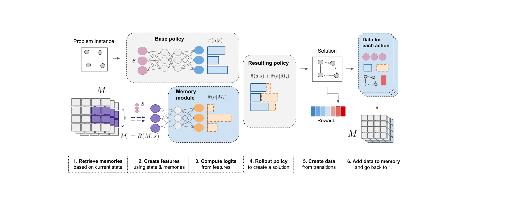

#  MEMENTO : Memory-Enhanced Neural Solvers for Efficient Adaptation in Combinatorial Optimization 

[](https://www.python.org)
[](https://github.com/google/jax)
[](LICENSE)
[](https://arxiv.org/abs/2406.16424)


<p align="center">
        
</p>

## Welcome to MEMENTO! 👋
This repository contains the code for the paper Memory-Enhanced Neural Solvers for Efficient
Adaptation in Combinatorial Optimization ([Chalumeau et al., 2024](arxivlink)).

Combinatorial Optimization (CO) has a wide range of real-world applications and we introduce
MEMENTO as a flexible and scalable method composed of a memory and a processing module for solving
CO problems. MEMENTO can be combined with existing approaches such as COMPASS to boost their performance 
in and out of distribution, even for large instances.

This codebase contains the implementation of MEMENTO, MEMENTO-COMPASS, POMO, COMPASS and two CO problems: 
traveling salesman problem (TSP) and capacitated vehicle routing problem (CVRP) in JAX. We also provide the 
training and evaluation scripts for MEMENTO, along with the necessary checkpoints and problem dataset files. 

We are currently busy sorting out the checkpoints release. They will be available in a couple days.

## Code Overview 📁
We provide implementations of MEMENTO and MEMENTO-COMPASS on all instances as well as POMO and COMPASS 
on larger instances. Therefore, the codebase is organised into four (4) branches, each for each method. 
The are branches organised as follow:

[MEMENTO](https://github.com/instadeepai/memento/tree/main) main folders and files are as follows:

- `memento`: contains the implementation of the CO problems, networks, and training procedure.
  - `/environments`: contains the implementation of the CO problems. 
  - `/memory`: contains the implementation of the memory.
  - `/networks`: contains the implementation of the networks.
  - `/trainers`: contains the training and validation procedures for MEMENTO.
  - `/utils`: contains the utility functions.
- `data`: contains the problem datasets and checkpoints.
- `experiments`: contains the training and evaluation scripts for MEMENTO.

[MEMENTO-COMPASS](https://github.com/instadeepai/memento/tree/memento-compass) main folders and files are as follows:

- `memento`: contains the implementation of the CO problems, networks, and training procedure.
  - `/environments`: contains the implementation of the CO problems. 
  - `/memory`: contains the implementation of the memory.
  - `/networks`: contains the implementation of the networks.
  - `/trainers`: contains the training and validation procedures for MEMENTO-COMPASS.
  - `/utils`: contains the utility functions.
- `data`: contains the problem datasets and checkpoints.
- `experiments`: contains the training and evaluation scripts for MEMENTO-COMPASS.

[POMO](https://github.com/instadeepai/memento/tree/pomo) main folders and files are as follows:

- `memento`: contains the implementation of the CO problems, networks, and training procedure.
  - `/environments`: contains the implementation of the CO problems. 
  - `/networks`: contains the implementation of the networks.
  - `/trainers`: contains the training and validation procedures for POMO.
  - `/utils`: contains the utility functions.
- `data`: contains the problem datasets and checkpoints.
- `experiments`: contains the training and evaluation scripts for POMO.

[COMPASS/EAS](https://github.com/instadeepai/memento/tree/compass) main folders and files are as follows:

- `memento`: contains the implementation of the CO problems, networks, and training procedure.
  - `/environments`: contains the implementation of the CO problems. 
  - `/networks`: contains the implementation of the networks.
  - `/trainers`: contains the training and validation procedures for COMPASS.
  - `/utils`: contains the utility functions.
- `data`: contains the problem datasets and checkpoints.
- `experiments`: contains the training and evaluation scripts for COMPASS.
Note: we also provide the implementation of [EAS](https://arxiv.org/pdf/2106.05126.pdf) in JAX, 
which is a baseline method for COMPASS. The implementation can be found in 
`compass/trainers/eas_emb.py`, and the script to run EAS can be found in `experiments/eas.py`.

## Reproducing the Results 📈

### Installation 🛠️
We recommend using docker to run the code. 
The docker image can be built using the following command, for TPU version:
```
make docker_build_tpu
```
or for local (GPU or CPU) version:
```
make docker_build_local
```

To start and enter docker container run the following commands:
```
make docker_start
make docker_enter
```

### Training 🏋️‍

To train MEMENTO, POMO, COMPASS or MEMENTO-COMPASS on a given problem instance, run the following command:
```
chmod +x experiments/train_tsp_100.sh
./experiments/train_tsp_100.sh
```
where `train_tsp_100.sh` can be changed to
- `train_tsp_500.sh` for TSP500
- `train_cvrp_100.sh` for CVRP100
- `train_cvrp_500.sh` for CVRP500 

These bash scripts contain parameters, problem-related and training-related hyperparameters used to train checkpoints. 
The default values are reported in the paper.

### Evaluation 📊
We provide two different evaluation scripts:

- `validate.py` which runs the evaluation of compass for the fast (small budget) setting.
- `slowrl_validate.py` which runs the full evaluation process for compass given the entire budget of rollouts.

To reproduce the TSP results reported in the paper for TSP problem size 100, run the following command:
```
chmod +x experiments/evaluate_tsp_100.sh
./experiments/evaluate_tsp_100.sh
```


## Citing MEMENTO ✏️
If you use MEMENTO in your work, please cite our paper:
```
@misc{chalumeau2024memoryenhanced,
      title={Memory-Enhanced Neural Solvers for Efficient Adaptation in Combinatorial Optimization}, 
      author={Felix Chalumeau and Refiloe Shabe and Noah de Nicola and Arnu Pretorius and Thomas D. Barrett and Nathan Grinsztajn},
      year={2024},
      eprint={2406.16424},
}
```

## Acknowledgements 🙏

This research was supported with Cloud TPUs
from Google's [TPU Research Cloud](https://sites.research.google/trc/about/) (TRC) 🌤.


## Contributors 🤝

<a href="https://github.com/felixchalumeau" title="Felix Chalumeau"></a>
<a href="https://github.com/refiloe-shabe" title="Refiloe Shabe"></a>
<a href="https://github.com/noahdenicola" title="Noah De Nicola"></a>
<a href="https://github.com/nathangrinsztajn" title="Nathan Grinsztajn"></a>
<a href="https://github.com/tomdbar" title="Thomas D. Barrett"></a>
<a href="https://github.com/arnupretorius" title="Arnu Pretorius"></a>
